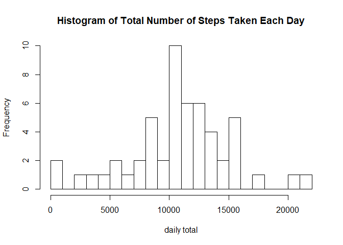
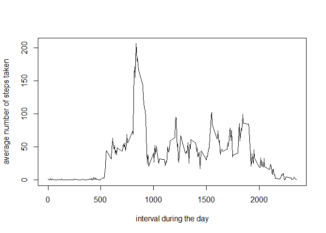
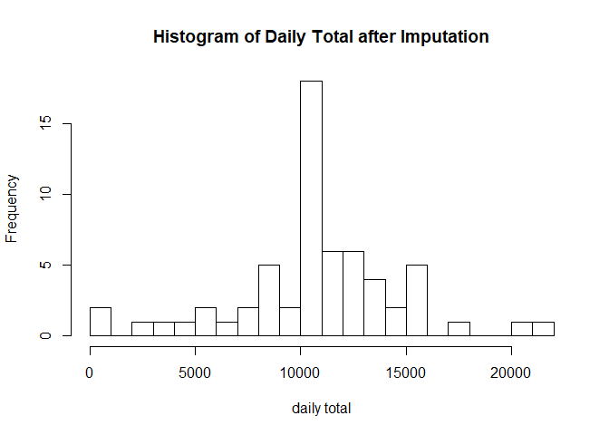

# Reproducible Research: Peer Assessment 1
## Author: Lei Cheng
## Date: 1/20/2019

**Commit containing full submission**

1. Code for reading in the dataset and/or processing the data
2. Histogram of the total number of steps taken each day
3. Mean and median number of steps taken each day
4. Time series plot of the average number of steps taken
5. The 5-minute interval that, on average, contains the maximum number of steps
6. Code to describe and show a strategy for imputing missing data
7. Histogram of the total number of steps taken each day after missing values are imputed
8. Panel plot comparing the average number of steps taken per 5-minute interval across weekdays and weekends
9. All of the R code needed to reproduce the results (numbers, plots, etc.) in the report


## Loading and preprocessing the data

1. Load the data (i.e. \color{red}{\verb|read.csv()|}read.csv())
2. Process/transform the data (if necessary) into a format suitable for your analysis

```r
library(tidyverse)
unzip ("activity.zip",exdir=".")
activity<-read_csv("activity.csv")
str(activity)
```

```
## Classes 'spec_tbl_df', 'tbl_df', 'tbl' and 'data.frame':	17568 obs. of  3 variables:
##  $ steps   : num  NA NA NA NA NA NA NA NA NA NA ...
##  $ date    : Date, format: "2012-10-01" "2012-10-01" ...
##  $ interval: num  0 5 10 15 20 25 30 35 40 45 ...
##  - attr(*, "spec")=
##   .. cols(
##   ..   steps = col_double(),
##   ..   date = col_date(format = ""),
##   ..   interval = col_double()
##   .. )
```

## What is mean total number of steps taken per day?

1. Calculate the total number of steps taken per day
2. Make a histogram of the total number of steps taken each day
3. Calculate and report the mean and median of the total number of steps taken per day


```r
daily<-activity%>%group_by(date)%>%
  summarize(daily_total=sum(steps))

hist(daily$daily_total,breaks = 20,xlab = "daily total",
     main = "Histogram of Total Number of Steps Taken Each Day")
```

<!-- -->

```r
mean(daily$daily_total,na.rm = T)
```

```
## [1] 10766.19
```

```r
median(daily$daily_total,na.rm = T)
```

```
## [1] 10765
```


## What is the average daily activity pattern?
1. Make a time series plot (i.e. \color{red}{\verb|type = "l"|}type="l") of the 5-minute interval (x-axis) and the average number of steps taken, averaged across all days (y-axis)
2. Which 5-minute interval, on average across all the days in the dataset, contains the maximum number of steps?


```r
by_interval<-activity%>%group_by(interval)%>%
  summarise(interval_mean=mean(steps,na.rm = T))
plot(by_interval$interval,by_interval$interval_mean,type="l",
     xlab="interval during the day", 
     ylab = "average number of steps taken")
```

<!-- -->

```r
max(by_interval$interval_mean)
```

```
## [1] 206.1698
```

```r
by_interval[which.max(by_interval$interval_mean),1]
```

```
## # A tibble: 1 x 1
##   interval
##      <dbl>
## 1      835
```

## Imputing missing values

1. Calculate and report the total number of missing values in the dataset (i.e. the total number of rows with \color{red}{\verb|NA|}NAs)
2. Devise a strategy for filling in all of the missing values in the dataset. I use the mean for that 5-minute interval.
3. Create a new dataset that is equal to the original dataset but with the missing data filled in.
4. Make a histogram of the total number of steps taken each day and calculate and report the mean and median total number of steps taken per day. Do these values differ from the estimates from the first part of the assignment? What is the impact of imputing missing data on the estimates of the total daily number of steps?\

**Answer: Imputation had little impact on the mean and median because I used the mean to impute the missing values. The mean and median before and after the imputation are very similar. Imputation did raise the frequency of the highest bar in the histogram, which represents the mean and the median.**


```r
sum(is.na(activity$steps))
```

```
## [1] 2304
```

```r
table(activity$date[is.na(activity$steps)])
```

```
## 
## 2012-10-01 2012-10-08 2012-11-01 2012-11-04 2012-11-09 2012-11-10 
##        288        288        288        288        288        288 
## 2012-11-14 2012-11-30 
##        288        288
```

```r
activity_imputed<-activity
activity_imputed$steps[is.na(activity$steps)]<-by_interval$interval_mean
sum(is.na(activity_imputed$steps))
```

```
## [1] 0
```

```r
daily_imputed<-activity_imputed%>%
  group_by(date)%>%
  summarize(daily_total=sum(steps))

hist(daily_imputed$daily_total,breaks = 20,xlab = "daily total",
     main = "Histogram of Daily Total after Imputation")
```

<!-- -->

```r
mean(daily_imputed$daily_total)
```

```
## [1] 10766.19
```

```r
median(daily_imputed$daily_total)
```

```
## [1] 10766.19
```


## Are there differences in activity patterns between weekdays and weekends?
1. Create a new factor variable in the dataset with two levels – “weekday” and “weekend” indicating whether a given date is a weekday or weekend day.
2. Make a panel plot containing a time series plot (i.e. \color{red}{\verb|type = "l"|}type="l") of the 5-minute interval (x-axis) and the average number of steps taken, averaged across all weekday days or weekend days (y-axis). See the README file in the GitHub repository to see an example of what this plot should look like using simulated data.


```r
library(lattice)
activity_imputed<-activity_imputed%>%mutate(day=weekdays(date))
table(activity_imputed$day)
```

```
## 
##    Friday    Monday  Saturday    Sunday  Thursday   Tuesday Wednesday 
##      2592      2592      2304      2304      2592      2592      2592
```

```r
activity_imputed$weekend<-ifelse(activity_imputed$day %in% c("Saturday","Sunday"),"weekend","weekday")  

weekend_weekday<-activity_imputed%>%group_by(weekend,interval)%>%summarise(average=mean(steps))

xyplot(average~interval|weekend,data=weekend_weekday,type="l",layout=c(1,2),ylab = "Number of Steps", xlab="Interval")
```

<!-- -->

